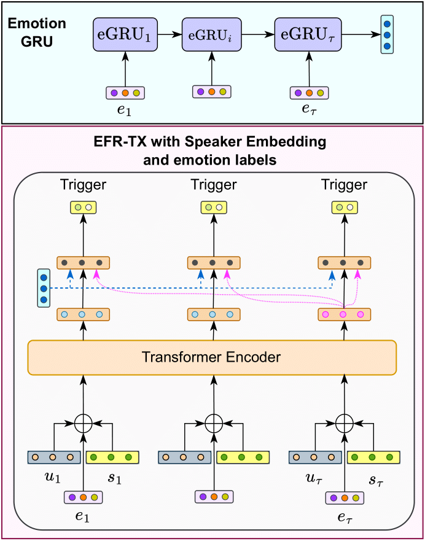

# IITK at SemEval-2024 Task 10: Emotion-Discovery-and-Reasoning-its-Flip-in-Conversation-EDiReF

The following repository contains the source code for our submission in the [Task 10 of SemEval-2024](https://lcs2.in/SemEval2024-EDiReF/).

## Table of Contents
- Paper
  - [Task Overview](#task-overview)
  - [Approach Overview](#approach-overview)
  - [System Architecture](#system-architecture)
    - [EFR](#efr)
    - [ERC](#erc)
  - [Probable Trigger Zone](#probable-trigger-zone)
  - [Results](#results)
- Code
  - [Directory Structure](#directory-structure)
  - [Running](#running)
    - [ERC Model - Training and Inference](#erc-model---training-and-inference)
    - [EFR Model - Training and Inference](#efr-model---training-and-inference)
  - [Our Models:](#our-models)
    - [Drive Directory Structure](#drive-directory-structure)
  - [Code Reference](#code-reference)

## Task Overview

The Task consists of Emotion Recognition in Conversation (ERC) and Emotion Flip Reasoning (EFR)
- ERC: Classifying utternaces in the conversation into given emotion categories.
- EFR: Identifying the parts of the conversation that caused the emotion of a speaker to change.
- Sub-Task 1 was ERC in Hindi-English Code-Mixed Conversations.
- Sub-Task 2 was EFR in Hindi-English Code-Mixed Conversations.
- Sub-Task 3 was EFR in English Conversations.

## Approach Overview

For the Emotion Recognition in Conversations (ERC) task, we utilize a masked-memory network along with speaker participation. We propose a transformer-based speaker-centric model for the Emotion Flip Reasoning (EFR) task. We also introduce Probable Trigger Zone, a region of the conversation that is more likely to contain the utterances causing the emotion to flip. For sub-task 3, the proposed approach achieves a 5.9 (F1 score) improvement over the task baseline.

## System Architecture

### EFR

The target utterance is denoted by the subscript $\tau$. Each utterance $u_{t}$ of a dialogue $d$ is concatenated with its true emotion label $e_t$ and one-hot speaker embedding $s_{t}$. This is then passed through the transformer to take into account the context. The Emotion-GRU computes the emotion-history vector. For each utterance, its and the target utterance's contextualized representation and the emotion-history vector are passed through a linear layer to make the prediction.

<p align="center">
  
</p>

### ERC

HingBERT is used to encode each utterance and then pass them through a dialog-level GRU and a speaker-level GRU. The vectors from the global-level GRUs are passed through a memory network through multiple hops (a cycle of reading from memory and writing back to memory is called a hop. The output is taken from the final memory read operation.) Then, attention is computed between the memory and speaker-level outputs while masking future utterances and concatenating with speaker-level outputs to compute conversation-level outputs. Finally, the obtained features are passed through a trainable linear layer for predicting emotion class.

<p align="center">
  
</p>

## Probable Trigger Zone

For the task of EFR, we propose a hypothesis regarding the possible location of triggers. We divide the conversation into two parts. The first part consists of the utterances before the target speaker's previous utterance. The second part consists of utterances from the target speaker's previous utterance to his target utterance. We call the second part the Probable Trigger Zone (PTZ). 

<p align="center">
  
</p>

## Results

Following are the results obtained by our systems on the final test set.

| **Sub-Task** | **Metric**  | **Our** | **Best** | **Rank** |
|:------------:|:-----------:|:-------:|:--------:|:--------:|
| 1            | Weighted F1 | 44.80   | 78       | 9        |
| 2            | F1          | 56.35   | 79       | 5        |
| 3            | F1          | 59.78   | 79       | 10       |


## Directory Structure

```bash
IITK-SemEval-2024-Task-10-Emotion-Flip/
├── Data
│   ├── Sub-Task 1
│   │   ├── MaSaC_test_erc.json
│   │   ├── MaSaC_train_erc.json
│   │   └── MaSaC_val_erc.json
│   ├── Sub-Task 2
│   │   ├── MaSaC_test_efr.json
│   │   ├── MaSaC_train_efr.json
│   │   └── MaSaC_val_efr.json
│   └── Sub-Task 3
│       ├── MELD_test_efr.json
│       ├── MELD_train_efr.json
│       └── MELD_val_efr.json
├── Dataloaders
│   ├── EFR_Dataloader.py
│   ├── ERC_Dataloader.py
│   ├── README.md
│   └── nlp_utils.py
├── Inference
│   ├── README.md
│   ├── Sub-Task 1.ipynb
│   ├── Sub-Task 2.ipynb
│   └── Sub-Task 3.ipynb
├── README.md
├── Training
│   ├── README.md
│   ├── Sub-Task 1.ipynb
│   ├── Sub-Task 2.ipynb
│   └── Sub-Task 3.ipynb
└── Utility
    ├── README.md
    ├── combine_predictions.ipynb
    ├── erc_data_modify.ipynb
    ├── hing_bert_embeddings.ipynb
    ├── hypothesis.ipynb
    ├── json_to_csv.ipynb
    └── voyage_embeddings.ipynb
```

- `Data/`
    - Consisits of the training, validation and test data for all the three subtasks.
- `Dataloaders/`
    - Consists of the code to convert data into pickle files which the model uses.
- `Inference/`
    - Consists of codes utilised for inference phase of models.
- `Pickles/`
    - Consists of the utterance embedding pickle files we utilised for our submission.
- `Training/`
    - Consists of codes for training the models.
- `Utility/`
    - `combine_predictions.ipynb`
        - To combine the predictions for all three tasks into the competition excepected format.
    - `hing_bert_embeddings.ipynb`
        - To compute utterance embeddings for Hindi-English Code Mixed Utterances.
        - Produces `sent2emb.pickle`.
    - `erc_data_modify.ipynb`
        - Splits the data into smaller conversations for the ERC Task.
    - `hypothesis.ipynb`
        - Transforms the predicitons of the model for the EFR task accoring to the hypothesis we have proposed in the paper.
    - `json_to_csv.ipynb`
        - Prunes and modifies the data according to specifications and converts it to a form expected by dataloaders.
    - `voyage_embeddings.ipynb`
        - To compute utterance embeddings for English Utterances.
        - Produces `sent2emb.pickle`.


## Running

### ERC Model - Training and Inference

- Split the data using `erc_data_modify.ipynb`.
- Convert the new data into csv format using `json_to_csv.ipynb`.
- Compute the utterance embeddings.
- Generate pickle files following instructions given in Dataloaders.
- Train the model.
- For prediction, similar to training, generate the pickle files by setting both train and val paths with corresponding test paths.
- Run the inference scripts.

### EFR Model - Training and Inference

- Convert it into csv format using `json_to_csv.ipynb`.
- Compute the utterance embeddings.
- Generate pickle files following instructions given in Dataloaders.
- Train the model.
- For prediction, similar to training, generate the pickle files by setting both train and val paths with corresponding test paths.
- Run the inference scripts.
- Apply the hypothesis on the predictions using `hypothesis.ipynb`.

## Our Models: 

The models trained and used for submission can be found below

https://onedrive.live.com/?authkey=%21AEea%5FAq8BYWLHjw&id=A668F45668274EE0%2185349&cid=A668F45668274EE0

### Drive Directory Structure

```bash
Drive/
├── Models
│   ├── model-task1
│   ├── model-task2
│   └── model-task3
└── Pickles
    ├── Sub-Task 1 - HingBERT
    │   ├── Test
    │   │   └── sent2emb.pickle
    │   └── Train-Val
    │       └── sent2emb.pickle
    ├── Sub-Task 2 - HingBERT
    │   ├── Test
    │   │   └── sent2emb.pickle
    │   └── Train-Val
    │       └── sent2emb.pickle
    └── Sub-Task 3 - Voyage
        ├── Test
        │   └── sent2emb.pickle
        └── Train-Val
            └── sent2emb.pickle
```

- `Models/`
    - Consists of the trained models.
- `Pickles/`
    - Consists of the pickles utilised for training and testing the models.

## Code Reference

https://github.com/LCS2-IIITD/Emotion-Flip-Reasoning
